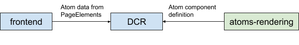

# Atoms Rendering

## Atoms



An Atom is a self contained piece of content that can be inserted into multiple articles. This repository implements atom definitions as part of a library which can be imported into the appropriate rendering service ([dotcom-rendering](https://github.com/guardian/dotcom-rendering) or [apps-rendering](https://github.com/guardian/apps-rendering)). Once imported, you can configure your rendering service to render the atom component for the atom data passed from your backend ([frontend](https://github.com/guardian/frontend) in the case of web).

## Usage

### import

To import an atom in your project use `yarn add @guardian/atoms-rendering` then

```
import { TheAtomYouWant } from '@guardian/atoms-rendering';

<TheAtomYouWant someProp={localData.someProp} />
```

### Naming conventions

There is mostly a one to one correspondance between atoms as named by CAPI/frontend and their names in atoms-rendering, with the notable exception that the Media atom is named YoutubeAtom here.

## Running locally

```
$ git clone https://github.com/guardian/atoms-rendering.git
or
$ git clone git@github.com:guardian/atoms-rendering.git
```

Make sure that you have `yarn` installed, if not run

```
$ brew install yarn
```

Then,

```
$ yarn
$ yarn storybook
```

The available yarn commands are given below:

```typescript
    "scripts": {
        "build": "microbundle --jsx React.createElement",
        "dev": "microbundle watch --jsx React.createElement",
        "storybook": "start-storybook -p 6006",
        "build-storybook": "build-storybook",
        "tsc": "tsc",
        "lint": "eslint . --ext .ts",
        "test": "jest --watch"
    }
```

## Testing locally

If you want to test a change before publishing to NPM, you will need to point to this repository. For instance, you might want to check in dotcom-rendering on local that a change you make in this library is correct. For this do the following

-   In atoms-rendering run `yarn build`,
-   In atoms-rendering run `yarn link`, then
-   In dotcom-rendering run `yarn link "@guardian/atoms-rendering"`.

Then you will notice that your

```
dotcom-rendering/node_modules/@guardian/atoms-rendering
```

is a symlink to the atoms-rendering repository.

When you are done, you should

-   In dotcom-rendering run `yarn unlink "@guardian/atoms-rendering"`.
-   In atoms-rendering run `yarn unlink`

And in dotcom-rendering you might also want to run

-   `yarn install --force`, to get the regular package re-installed.

## Adding a new atom

Adding a new atom in `atoms-rendering` involves

1. Adding the component, eg. MyComponent.tsx - Make sure the outer component of the atom contains `data-atom-id` and `data-atom-type` in order to be picked up by teleporter. [Here is an example](https://github.com/guardian/atoms-rendering/blob/16b72b5e82101f30771aa823668fff632143ffa0/src/AudioAtom.tsx#L327)
2. Adding stories, eg. MyComponent.stories.tsx
3. Adding a line to `index.ts` to export the component
4. Publishing a new version of the library to Npm (see below)

An example PR for adding the Profile Atom can be found [here](https://github.com/guardian/atoms-rendering/pull/35/files). The component is defined in [/src/ProfileAtom.tsx](https://github.com/guardian/atoms-rendering/blob/main/src/ProfileAtom.tsx), with the supporting type ProfileAtomType in [src/types.tsx](https://github.com/guardian/atoms-rendering/blob/main/src/types.ts). Types are transpiled when this project is built, and are made available to your rendering project when you include the published library as a dependency.

## Releasing a new version / Publishing to NPM

Prerequisites:

1. Ensure your changes are on main
2. Ensure you have an [npm account](https://docs.npmjs.com/creating-and-publishing-scoped-public-packages) that is authorised for the npm @guardian organisation

Then:

`yarn release --patch` or `yarn release --minor` or `yarn release --major`

Once complete, you can update the version of `@guardian/atoms-rendering` in any consuming project to see the changes

## Snyk Code Scanning

There's a Github action set up on the repository to scan for vulnerabilities. This is set to "continue on error" and so will show a green tick regardless. In order to check the vulnerabilities we can use the Github code scanning feature in the security tab and this will list all vulnerabilities for a given branch etc. You should use this if adding/removing/updating packages to see if there are any vulnerabilities.
